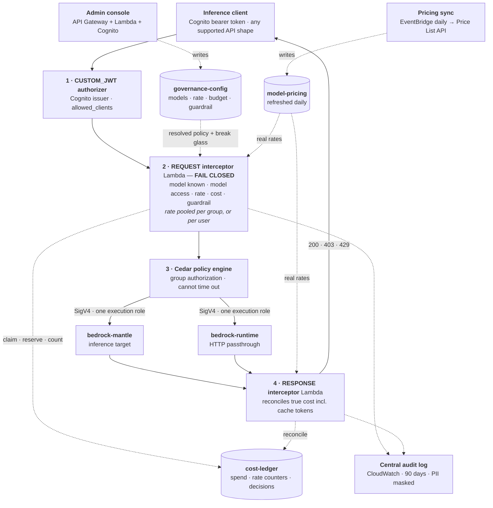

# A Unified Governance Plane for Serverless Inference on AWS

An **art-of-the-possible** demonstration: send an inference request for any model, on any
endpoint, through **Amazon Bedrock AgentCore Gateway**, and have one governance plane apply
to every request — regardless of which upstream surface serves it.

Demonstrated against **both** Bedrock serverless surfaces:

- **bedrock-mantle** — the unified serverless surface (110+ models, ~12 model providers)
- **bedrock-runtime** — the classic runtime API, including cross-region inference profiles

Everything is deployed by CDK and validated against live infrastructure. Every result quoted
here is a real HTTP response.

---

## Why put a gateway in front of inference

The Bedrock surfaces do not offer the same native controls — mantle, for instance, has no
native invocation logging and no guardrail support. Governance built per-surface therefore
ends up uneven, and anything enforced inside application code can be bypassed by the next
application.

One gateway in front of inference gives one place to answer:

- **Who** may use inference at all?
- **Which models** is a user or team entitled to?
- **What content rules** apply to every prompt, no exceptions?
- **How fast**, and **how much** may they spend?
- **Who did what**, when the gateway calls Bedrock under a single shared role?

## What is demonstrated

| # | Capability | Enforced at | Verified result |
|---|---|---|---|
| 1 | **Group authorization** — *may you use inference at all?* | Cedar policy engine | non-member → `403` |
| 2 | **Model entitlement** — *which models?* | REQUEST interceptor ← config table | not entitled → `403 model_access_denied` |
| 3 | **Guardrails** — *is this prompt allowed?* | REQUEST interceptor → `ApplyGuardrail` | prompt injection → `403`, model never invoked |
| 4 | **Rate limits** — *how fast, shared with whom?* | REQUEST interceptor ← config table | over allowance → `429 rate_limit_exceeded` |
| 5 | **Cost budgets** — *how much?* | REQUEST reserve + RESPONSE reconcile | over budget → `429 cost_budget_exceeded`, and a denial costs $0 |
| 6 | **Fail closed** — *cannot decide?* | REQUEST interceptor deadline + wrapper | → `403`, never a silent `200` |
| 7 | **Accountability** — *who asked what?* | both interceptors → one audit log | user, decision, prompt, response, tools |

All of these hold on **both** surfaces, and through every API shape the gateway accepts.
Supporting machinery: browser-free Cognito authentication, runtime-reconfigurable policy in
DynamoDB, prices refreshed daily from the AWS Price List API, and an admin console.

Cost accounting prices all five billable quantities — input, output, cache read, and cache
write at both the 5-minute and 1-hour TTL tiers — and reserves symmetrically: every denial
path refunds, so being refused costs nothing. Both properties are covered by tests rather
than asserted, including a structural one that fails if a newly added control forgets the
refund.

## The central finding

**Native gateway rate limits cannot carry cross-surface governance.** They apply only on
recognised inference paths (`/v1/messages`, `/v1/chat/completions`, `/v1/responses`), so they
do nothing for a bedrock-runtime passthrough target — requests sail through looking healthy.
They meter **input tokens only**, so they never bound generation spend. And they key on a
scalar claim, so a shared team allowance is inexpressible.

**A request interceptor is the only place uniform governance can live.** It runs pre-dispatch,
sees the JWT *and* the full request body on every surface, and can short-circuit with any
status. Entitlement, guardrails, rate limits and cost are therefore all interceptor-enforced —
there is no native gateway rate limit in the stack, because a control that spans only one
surface is not a backstop.

Measured, same request, both surfaces — every control produces an identical status because
each is enforced pre-dispatch rather than by a surface-specific mechanism:

| Control | mantle | runtime | enforced by |
|---|---|---|---|
| Group authorization | `403` | `403` | Cedar policy |
| Model entitlement | `403` | `403` | interceptor + config table |
| Guardrail (prompt injection) | `403` | `403` | interceptor → `ApplyGuardrail` |
| Rate limit (tokens / requests, poolable) | `429` | `429` | interceptor + `RATE#` counters |
| Cost budget (true spend) | `429` | `429` | interceptor + ledger |

A native token rate limit would break that symmetry — it fires on mantle and never on the
runtime passthrough. That asymmetry, and why keeping it as a backstop was rejected, is under
*Rate limits* in [`docs/FINDINGS.md`](docs/FINDINGS.md).

**Concentrating enforcement in one place makes its failure modes load-bearing.** A REQUEST
interceptor that *times out* makes the gateway return `200` with the model invoked and no
governance applied — measured, undocumented, and the failure mode most likely to occur in
production. The interceptor therefore enforces its own deadline and denies on its own terms
rather than letting the Lambda runtime kill it. The full failure matrix, and why this made us
delete error handling rather than add it, is the opening section of
[`docs/FINDINGS.md`](docs/FINDINGS.md).

## Architecture



Four things are worth internalizing:

1. **The interceptor runs before dispatch and before Cedar.** The first layer to object is the
   one the caller sees. With native rate limits gone it is the only layer that can return a
   `429`, so identical requests produce identical statuses on both surfaces by construction.
2. **Cedar is layer 3 on purpose.** It governs one boolean — group membership — and is the only
   enforcement path involving none of our code and no Lambda that can time out.
3. **The console and the interceptor share one source of truth**, the config table. Policy is
   runtime state, so an admin change takes effect within the cache TTL (~10s), no deployment.
   The break-glass switch rides the same path, which is why recovery needs no deploy either.
4. **Both interceptors write to one audit log**, so the request and response halves of a call
   are searchable together.

**The two surfaces attach differently.** Mantle is an inference target; runtime *must* be an
HTTP passthrough target with an explicit SigV4 signing service. Both hops are SigV4-signed by
the same execution role — the caller never holds AWS credentials.

For the in-depth view — every element, the enforcement ordering, the data flows — open
[`architecture-diagram.html`](architecture-diagram.html) in a browser.

## Quick start

**Prerequisites:** an AWS account with Bedrock model access enabled for
`anthropic.claude-sonnet-5` and `anthropic.claude-opus-5`, CDK bootstrapped, Python 3.12+,
Node 18+ (for the CDK CLI), and credentials on the CLI. Everything else, including the
identity provider, is created for you. Verified in `us-east-1`.

```powershell
python -m venv .venv
.\.venv\Scripts\python.exe -m pip install -r requirements.txt
npx cdk deploy AcgwPilotFoundationStack --require-approval never
.\.venv\Scripts\python.exe -m jupyter lab walkthrough.ipynb
```

The target account and region come from your ambient AWS configuration, so there is nothing
to edit before deploying. Run `walkthrough.ipynb` top to bottom; its first cell calls
`ic.discover()`, which reads your CloudFormation outputs, so it targets **your** deployment
with no ids to change.

Prefer no notebook? `.\.venv\Scripts\python.exe -m pilot.inference_client` runs a smoke test.

**Admin console** — the URL and the demo admin password are both stack outputs; sign in as
`gwadmin` with the `AdminUserPassword` value:

```powershell
aws cloudformation describe-stacks --stack-name AcgwPilotFoundationStack `
  --query "Stacks[0].Outputs[?OutputKey=='AdminConsoleUrl'||OutputKey=='AdminUserPassword'].{Key:OutputKey,Value:OutputValue}" --output table
```

Demo passwords are generated at deploy time (or set via `ACGW_DEMO_PASSWORD` /
`ACGW_ADMIN_PASSWORD`), never hardcoded — see [`docs/DEPLOYMENT.md`](docs/DEPLOYMENT.md).

Change model access, budgets or guardrail bindings there and watch enforcement follow within
about ten seconds.

Full instructions, model-access setup, demo credentials and a troubleshooting table:
[`docs/DEPLOYMENT.md`](docs/DEPLOYMENT.md).

## Governance model

**One identity axis: group membership.** It answers two different questions through two
different mechanisms:

- *May you use inference at all?* → **Cedar policy** on `cognito:groups`
- *Which models, how fast, how much?* → **the config table**, on `GROUP#` and `USER#` scopes

Policy lives in a DynamoDB **config table**, not in code:

| Key | Values |
|---|---|
| `pk` (scope) | `DEFAULT` · `GROUP#<group>` · `USER#<username>` |
| `sk` (kind) | `MODELS` (allow/deny globs) · `RATELIMIT` (tokens + requests + window + pooled) · `BUDGET` (usd + window) · `GUARDRAIL` (id + enabled) |

Resolution is **`USER` → `GROUP` → `DEFAULT`**, per kind, first match wins. One glob covers
both surfaces: `*claude-opus*` matches mantle's `anthropic.claude-opus-5` and runtime's
`us.anthropic.claude-opus-5`.

Entitlement is expressed as **deny at the default, permit for a group**. Add someone to
`ml-research` and their access changes immediately — no claim to re-issue, no token to
refresh. A group's rate allowance can be **pooled** — shared across the team rather than
granted per member.

One further row, `DEFAULT`/`BREAKGLASS`, bypasses enforcement entirely. It exists because the
interceptor is fail-closed, so a governance bug is an inference outage — a trade that is only
acceptable if recovery is a table write rather than a deployment. Every bypassed request is
recorded with who set it and why.

Demo identities:

| User | Groups | Base model | Premium model | Rate limit |
|---|---|---|---|---|
| `alice` | `ai-platform`, `ml-research` | `200` | `200` | pooled with the group |
| `bob` | `ai-platform` | `200` | `403` (entitlement) | per-user |
| `carol` | *(none)* | `403` (Cedar) | `403` | — |

## Governance does not depend on the API shape

The gateway accepts three inference contracts plus a runtime passthrough path, and each spells
the model and the prompt differently — the model can come from the body *or* the URL, and the
prompt can live in `messages[]`, `input`/`instructions`, or a bare `prompt`.

A single `_normalize()` in the interceptor reduces any accepted shape to
`{model, text_units, tool_specs, max_output_tokens}`, harvesting text by **structure** rather
than by known field names, and an unresolvable model fails closed. Verified: the same
entitlement denial on `InvokeModel`, `InvokeModelWithResponseStream`, `Converse`,
`ConverseStream` and all three inference contracts, and a prompt injection hidden inside a
Converse `toolResult` is caught.

Harvesting structurally is what makes that hold across shapes; the reasoning, and why a
field-lookup approach cannot, is under *Governance bypass by request shape* in
[`docs/FINDINGS.md`](docs/FINDINGS.md).

## The central audit log

One CloudWatch group, `/acgw-pilot/governance-audit`, holds a structured record of every
governance decision — independent of whatever Bedrock invocation logging is enabled at the
account level. Both interceptors write to it by pointing the Lambda `logGroup` property at the
**same** group, so a plain structured `print` is the whole write path. The REQUEST and RESPONSE
records for one call join on `request_id`.

Records carry identity, decision and scope, the model and API shape, tools offered and tools
actually called, token counts and true cost. **Prompt and response text are not logged by
default** — only a SHA-256 and a length, which is enough to correlate and detect tampering
without concentrating sensitive content in a log. A CloudWatch data protection policy masks 8
identifier types at ingest regardless, because content is not the only leak path.

```
fields @timestamp, username, surface, api_shape, model, decision, status
| filter audit = 1 and decision = "guardrail_blocked"
| sort @timestamp desc
```

Three decisions mean something is broken rather than that someone hit policy, and are worth
alarming on separately: `governance_timeout`, `governance_unavailable` and `breakglass_bypass`.

## Streaming: the one real trade-off

Where you enforce determines whether streaming survives. A REQUEST interceptor completes before
dispatch and never sits in the response path, so nothing is buffered. A RESPONSE interceptor —
which is what true output-token accounting requires — runs in **buffered mode only** for
inference targets, and the buffering is not tunable.

Measured on this stack: request-only interception delivers a 5.4s spread of genuine progressive
streaming; with output-token accounting attached, first-token latency goes 2.7s → 7.4s and the
spread collapses to 0.0s. Same SSE format, same content, all at once.

So **accurate spend control costs progressive streaming.** Set
`ENABLE_OUTPUT_TOKEN_ACCOUNTING = False` in `pilot/config.py` to reverse the choice and fall
back to prompt-only cost. Nothing else changes. Why it is binary rather than a buffer size, and
the MCP-only mechanism that would fix it, are under *Interceptor buffering is not tunable* in
[`docs/FINDINGS.md`](docs/FINDINGS.md).

## Limitations

This is a demonstration, not a production blueprint. The headlines:

- **A REQUEST-interceptor timeout fails open at the gateway** (`200`, model invoked). There is
  no setting for it; interceptor-based governance must enforce its own deadline.
- **bedrock-runtime cannot be an inference target** — the SigV4 service name is derived from
  the endpoint hostname, so runtime is served by an HTTP passthrough target instead.
- **Response interception is buffered and not tunable**, so true output-token cost and
  progressive streaming are mutually exclusive today.
- **Cedar cannot see the requested model**, and its group test is a substring match that a
  group name merely *containing* the target string would satisfy.
- **Gateway spans carry no identity or token counts**, and interceptor denials are not spanned
  at all — so span-derived denial counts undercount badly. Governance statistics come from the
  interceptor's own decision records instead.
- **No layer's own record is the request outcome.** The interceptor decides before Cedar, so the
  RESPONSE interceptor has to stamp the true final status back onto the record. A denial is
  attributed to Cedar by deduction, not by the gateway reporting it.
- **Fixed windows** for rate and budget, so a burst straddling a boundary briefly exceeds the
  intended rate.
- **Demo-grade identity**: passwords generated at deploy time (or set via env var) and exposed
  as stack outputs, password flow rather than hosted UI with PKCE, and the pool is destroyed
  with the stack.

The complete list, split into AWS service constraints you will hit too versus choices this demo
made, with the exact errors that proved each one, is the closing section of
[`docs/FINDINGS.md`](docs/FINDINGS.md) — **What to know before you rely on this**.

## Remaining work

- ⚠️ **Deterministic multi-group policy resolution.** A user in several groups resolves each
  policy kind from the **first** matching `GROUP#` row, walked in the order the access token
  lists the groups — an ordering nothing here sets or validates, and measured to be neither the
  declaration order nor ascending Cognito `precedence`. It does not behave as "most restrictive
  wins". Latent today because only one group carries a row of any given kind, but it is the first
  thing to fix before running this against a real directory. Two candidate designs — an explicit
  `priority` attribute, or merging all matching scopes deny-wins — are written up in
  [`docs/FINDINGS.md`](docs/FINDINGS.md).
- **Pooled *budgets*.** Rate limits pool across a group; cost budgets do not yet — a `GROUP#`
  budget still applies per member. Same fix: key the spend counter on the matched scope.
- **Console migration to S3 + CloudFront.** Deferred until the admin UI changes are done.
  Putting the SPA on private S3 behind CloudFront with the API on the same distribution removes
  the `CORS: *` gap and makes WAF attachable.
- **Admin mutations into the central audit log.** One line — the console function is not yet
  pointed at the shared log group, so "who changed the policy" and "what did we enforce" live
  in two places.
- **Point console statistics at the audit log** so they are not limited to the 24-hour decision
  TTL, and so the horizon is set by the archive rather than by what a DynamoDB scan can
  affordably retain. The data is already there for 90 days with the field indexes needed to
  query it; today the console links out to Logs Insights instead.
- **Alarm on the fail-closed decisions** — `governance_timeout`, `governance_unavailable` and
  `breakglass_bypass` belong on a metric filter, not just in a log.
- **Response-side content moderation** (output PII/redaction), for cases where buffering is
  already acceptable. The response text is extracted, so the hook exists.
- **Serving more than one API shape.** Governance covers all of them; this deployment's provider
  target declares only the Anthropic Messages operation, so the other shapes are governed and
  then rejected at routing.
- **Flex / priority throughput pricing.** The pricing sync ingests standard-tier rates only.
- **Verify retry idempotency against a real gateway retry**, if AWS exposes a way to force one.

## Repository layout

```
app.py                       CDK app entry
pilot/
  config.py                  single source of truth: models, users, pricing, limits, admin
  foundation_stack.py        gateway, role, targets, config table, ledger, guardrail,
                             interceptors, observability, admin console
  cognito.py                 user pool, groups, demo users, admin user
  guards.py                  synth-time security aspect: no publicly invokable Lambdas
  inference_client.py        discover / get_token / invoke / invoke_runtime / stream / spans
  lambda/guardrail/          REQUEST interceptor: normalizer, model access, rate, cost,
                             guardrail, audit — fail closed throughout
  lambda/usage/              RESPONSE interceptor: true-cost reconciliation + response audit
  lambda/pricing/            daily price refresh from the AWS Price List API
  lambda/admin/              admin console: JSON API + single-file SPA
walkthrough.ipynb            the walkthrough (run top to bottom against your deployment)
architecture-diagram.html    in-depth architecture: end-to-end diagram + element detail
docs/DEPLOYMENT.md           deploy into your own account: prereqs, steps, troubleshooting
docs/FINDINGS.md             what worked, what did not, and precisely why
docs/ADMIN-CONSOLE.md        console: config model, API, auth, production gaps
docs/APPENDIX-entra.md       what changes if you use Entra ID instead of Cognito
.kiro/steering/              agent working context (product, tech, structure, findings)
```

## Further reading

| Document | What it is for |
|---|---|
| [`architecture-diagram.html`](architecture-diagram.html) | **How it works, in depth.** Every element, the enforcement ordering, the data flows. |
| [`walkthrough.ipynb`](walkthrough.ipynb) | **Proof it works.** 16 runnable sections, run top to bottom against your own deployment. |
| [`docs/DEPLOYMENT.md`](docs/DEPLOYMENT.md) | **Deploying it yourself.** Prereqs, model access, teardown, troubleshooting. |
| [`docs/FINDINGS.md`](docs/FINDINGS.md) | **Why it is built this way.** Every mechanism that worked, every one that did not, and the exact errors that proved it — plus the full limitations list. |
| [`docs/ADMIN-CONSOLE.md`](docs/ADMIN-CONSOLE.md) | **The console.** Config model, API routes, the authz pattern, production gaps. |

`docs/FINDINGS.md` is the most valuable file here. Several controls are enforced through
mechanisms other than the most obvious one — entitlement via an interceptor rather than Cedar,
guardrails via an interceptor rather than native policy, runtime via passthrough rather than an
inference target. Each was reached by trying the obvious thing first and measuring why it
failed, and that record is the part worth reusing.

## Cost and teardown

Running cost is dominated by Bedrock token usage; the gateway, four small Lambdas, three
on-demand DynamoDB tables, Cognito and a guardrail are minor by comparison — but none of it
sits in a free tier. Two line items are easy to overlook: CloudWatch **data protection**
scanning is charged per GB ingested into the audit log, and the daily pricing refresh makes
~1400 Price List API calls (free, but a real Lambda invocation).

```powershell
npx cdk destroy AcgwPilotFoundationStack
```
