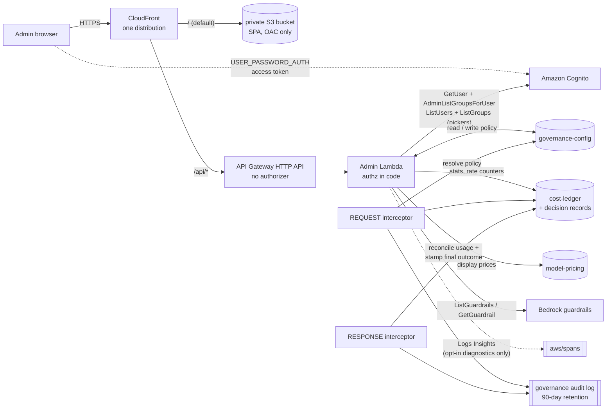

# Governance Admin Console

**Status: built and verified.** All required capabilities are delivered.

The console is served by **one CloudFront distribution with two origins**: the single-file
SPA is a static object in a **private S3 bucket** (origin-access-control only), and the JSON
API is a Lambda behind an API Gateway HTTP API, routed at `/api/*` on the same distribution.
Because the UI and the API answer on one origin there is no cross-origin request and **no
CORS**. Policy data lives in DynamoDB, so changes take effect at runtime with no deployment.

Four screens: **Model access**, **Rate & cost**, **Guardrails**, **Statistics**. Each one
explains the control it configures in prose, because the policy primitives are not
self-explanatory — `allow: ["*"]` beside `deny: ["*claude-opus*"]` is only unambiguous once
you know that scope resolution picks a single rule and deny wins inside it.

```
Stack outputs:  AdminConsoleUrl, AdminUserPassword
Sign in as:     gwadmin  /  <AdminUserPassword stack output>   (demo only)
```

---

## Capability status

| # | Required capability | Status | Where it is enforced |
|---|---|---|---|
| 1 | View and configure **model access** for users/groups | ✅ delivered | config table → interceptor |
| 2 | View and configure **model cost limits** (daily + monthly) for users/groups | ✅ delivered | config table → interceptor + ledger |
| 3 | View and configure **rate limits**, per user or pooled per group | ✅ delivered | config table → interceptor + `RATE#` counters |
| 4 | **Enforce guardrails** for specific users/groups | ✅ delivered | config table → interceptor |
| 5 | **View inference statistics** for all requests | ✅ delivered | interceptor decision records, outcome-resolved |
| 6 | Admin **login with Cognito credentials** | ✅ delivered | Cognito + admin-group check |

Every screen resolves its scope from a **picker over real Cognito users and groups** rather
than a free-text box. That is not cosmetic: a typed `GROUP#ml-reserch` is accepted by the
table and produces a rule that silently never matches, which is the worst class of governance
bug — the console displays policy that does not exist.

---

## The governance config layer

Policy data is **runtime state**, not deploy-time configuration. That distinction is the
whole reason the console can exist: an admin can change a table row in seconds, and the
interceptor picks it up within the cache TTL, with no deployment.

**Table:** `acgw-pilot-governance-config`

| Key | Values |
|---|---|
| `pk` (scope) | `DEFAULT` · `GROUP#<group>` · `USER#<username>` |
| `sk` (kind) | `MODELS` · `RATELIMIT` · `BUDGET` · `GUARDRAIL` |

| Kind | Attributes | Meaning |
|---|---|---|
| `MODELS` | `allow[]`, `deny[]` | glob lists matched against the model id; **deny wins** |
| `RATELIMIT` | `tokens_per_window`, `requests_per_window`, `window_seconds`, `pooled` | tokens/requests per window; `pooled` decides whether the allowance is **shared across the scope** or granted per user |
| `BUDGET` | `daily_budget_usd`, `monthly_budget_usd` | independent daily + monthly spend caps per principal; **either can deny** (0/absent = that window not enforced). A legacy `budget_usd`/`window_seconds` row is still honoured as the daily cap. |
| `GUARDRAIL` | `guardrail_id`, `guardrail_version`, `enabled` | which Bedrock guardrail applies, at which version, or none |

Plus one row that is operational rather than policy, and lives only at the `DEFAULT` scope:

| Kind | Attributes | Meaning |
|---|---|---|
| `BREAKGLASS` | `enabled`, `reason`, `set_by` | ⚠️ **bypasses all enforcement** while `enabled` is true |

**Resolution precedence**, evaluated independently per kind:

```
USER#<username>   →   GROUP#<group>   →   DEFAULT
```

Scopes are `USER#`, `GROUP#` and `DEFAULT` — group membership is the only identity axis.

First match wins, so a user-level rule overrides their group's, which overrides the global
default. Verified: a `USER#bob` allow-all row lets bob reach a model `DEFAULT` denies, and
deleting the row puts him back — absence is what makes resolution fall through.

**Rules do not merge.** Only the first matching row for that kind is evaluated. This trips
people up because two rules can look additive when they are not: the shipped policy denies opus
at `DEFAULT` and grants it at `GROUP#ml-research` by giving that group its own rule with an
*empty* deny list, not by removing anything from `DEFAULT`.

> ⚠️ **A user in several groups resolves by claim order, not by priority.** The chain walks the
> groups in the order the access token lists them, and the first row found wins — so for a user
> whose groups both carry a row of the same kind, which one applies is decided by an ordering
> nothing here sets or validates. It does **not** behave as "most restrictive wins", so adding
> someone to a more restrictive group may not restrict them. This is latent while only one group
> carries a row of any given kind, which is true of the shipped policy. It is the first thing to
> address before running this against a real directory — the mechanism, the measured evidence and
> the candidate fixes are in `docs/FINDINGS.md` under the multi-group future enhancement. Until
> then: **one group per kind, with `USER#` rows for exceptions.**

### ⚠️ A guardrail id is only half of a guardrail binding

`guardrail_version` is part of the row because one guardrail id serves a **mutable `DRAFT`**
plus any number of **immutable published versions**, and their content policies can differ. An
id on its own does not say what will be enforced, so the version travels with it.

Binding a **published** guardrail without the version breaks it two ways, the second worse:

| Failure | Effect |
|---|---|
| the version does not exist on that guardrail | `ApplyGuardrail` raises → the interceptor **fails closed** → every request in that scope gets `403` |
| the version exists but is not the one previewed | we silently enforce a **different content policy** than the console displayed |

Both are handled. The version travels in the row, `_apply_guardrail` takes it as a parameter,
and the env var is a fallback scoped to the case where the resolved id *is* the env default id.
For any other guardrail the default is `DRAFT`, the one version every guardrail is guaranteed to
have. The enforced version is also recorded on every decision, so the audit log answers "which
policy actually ran":

```json
{ "decision": "guardrail_blocked", "status": 403, "guardrail_id": "<guardrail-id>",
  "guardrail_version": "1", "model_invoked": false }
```

Verified live against a published version: the injection was blocked and a benign prompt allowed
while bound to version `1`; binding a nonexistent version `9999` **denied a benign request**
rather than letting it through.

#### The two `ListGuardrails` calls do not return the same thing

Worth knowing before building any guardrail picker, because it produced an empty version list on
the first attempt:

| Call | Returns |
|---|---|
| `list_guardrails()` | one entry per guardrail, **`DRAFT` only** — published versions are absent |
| `list_guardrails(guardrailIdentifier=<id>)` | one entry **per version** of that guardrail |

Verified directly: after publishing version `1`, the unfiltered call still reported only `DRAFT`
while the per-identifier call returned `DRAFT` and `1`. So versions are discoverable only per
guardrail. That is why they are returned by `GET /api/guardrails?id=<id>` (the detail call the UI
already makes when a guardrail is selected) rather than by the list endpoint, which would
otherwise pay an extra API call per guardrail on every page load.

#### Migrating an existing deployment

Because the config table is seeded **onCreate only**, a live table does not gain
`guardrail_version` from deploying this change. The fallback keeps enforcement correct in the
meantime, and the console marks such a row `DRAFT (implied)` rather than showing a blank. To make
it explicit, re-save the binding in the console, or:

```powershell
aws dynamodb update-item --table-name acgw-pilot-governance-config `
  --key '{"pk":{"S":"DEFAULT"},"sk":{"S":"GUARDRAIL"}}' `
  --update-expression "SET guardrail_version = :v" `
  --expression-attribute-values '{":v":{"S":"DRAFT"}}'
```

### The effective-access preview, and the namespace trap behind it

Reading `allow: *` next to `deny: *claude-opus*` and mentally applying scope precedence is not
a reasonable thing to ask of an operator, so `GET /api/effective?username=<u>` resolves it:
which models the user can actually reach, and **which glob decided each one**. There is also a
`&probe=<model-id>` parameter to test an arbitrary id that has not appeared in traffic yet.

⚠️ **The first version of this preview reported the opposite of the truth**, and the reason is
worth recording because it will catch anyone building a similar tool.

There are two model-id namespaces in this system:

| Namespace | Example | Where it lives |
|---|---|---|
| **Request-shaped** id | `bedrockprov/anthropic.claude-opus-5`, `us.anthropic.claude-opus-5` | what the interceptor resolves from the request, and therefore what globs are matched against |
| **Normalized** `model_key` | `claudeopus5` | the pricing table's partition key — punctuation stripped so one row serves every cross-region variant |

The preview initially enumerated the pricing table, so it matched `*claude-opus*` against
`claudeopus5` — which does not match — and reported opus as **allowed** for a user who is in
fact denied it. A preview that is confidently wrong is worse than no preview.

It now evaluates against request-shaped ids only, drawn from two sources: the canonical ids
this deployment routes to (passed from CDK as `GOVERNED_MODEL_IDS`, covering both surfaces) and
every distinct model id **observed in real decision records**, so the list grows to match actual
traffic. The pricing table is still returned for displaying rates, and is labelled as such.

The general rule: anything that evaluates policy must use the same namespace as the enforcement
point. Do not re-derive it from a store that normalizes differently.

### ⚠️ The break-glass row

The request interceptor is **fail closed**: if it cannot evaluate policy it denies. That is the
right posture, but it means an interceptor bug or a dependency outage is an *inference* outage.
This row is the mitigation, and it is the reason fail-closed is an acceptable trade at all —
recovery is a table write, not a deployment.

```
pk = DEFAULT   sk = BREAKGLASS
enabled = true   reason = "INC-1234 guardrail latency"   set_by = "gwadmin"
```

Behaviour worth knowing:

- Takes effect within the config cache TTL (**~10s**), no deploy.
- Checked **before the request body is parsed**, deliberately — "the interceptor is rejecting
  everything, including malformed bodies" is exactly the situation you would break glass for.
- Every bypassed request writes an audit record at `decision=breakglass_bypass` carrying
  `fail_open: true`, `breakglass_set_by` and `breakglass_reason`. Turning it on is loud and
  attributable; leaving it on is one Logs Insights query away from being noticed.
- It is seeded `enabled=false`. **It is not exposed in the console UI** — flipping it is a
  deliberate CLI or console-of-last-resort action, not a button someone can click by accident.
  If you do surface it, gate it behind a confirmation and require the `reason` field.

Alarm on it. `breakglass_bypass` appearing at all means governance is off.

**A single glob covers both Bedrock surfaces.** `*claude-opus*` matches mantle's
`anthropic.claude-opus-5` and runtime's `us.anthropic.claude-opus-5` alike, so admins
express intent once rather than per-surface.

**Caching and propagation.** The interceptor scans the table once per
`CONFIG_CACHE_TTL_SECONDS` (10s) per warm container, so the steady-state cost is roughly
one read per TTL rather than one per request. That TTL is therefore the worst-case delay
between saving in the console and enforcement changing. The UI says so on save.

**Seeding is `onCreate` only, deliberately.** A redeploy must never clobber changes an
administrator made at runtime. The trade-off: editing a seed value in code has no effect
on an existing table — the console is the intended path.

---

## Architecture



The console and the interceptor **share one source of truth** — the config table. Nothing
here calls `UpdateGatewayRateLimit`: native rate limits cannot span both surfaces, so they
are not the mechanism of record for anything the console manages.

Note what the console does **not** read: the central governance audit log. Its statistics come
from the decision records alone; the audit log is the durable copy for security review. See
*Relationship to the central audit log* below.

The Cognito reads split into two kinds, and it matters for least privilege: `GetUser` +
`AdminListGroupsForUser` authorize **the caller**, while `ListUsers` + `ListGroups` populate the
scope pickers. The guardrail reads (`ListGuardrails`, `GetGuardrail`) cannot be scoped to a
resource ARN by the API, so they are granted on `*`.

---

## API

| Route | Auth | Purpose |
|---|---|---|
| `GET /` | public | the SPA shell (no data) |
| `GET /api/meta` | public | region + client id, for the login form |
| `GET /api/config` | admin | all policy rows |
| `PUT /api/config` | admin | upsert a policy row |
| `DELETE /api/config` | admin | delete a policy row |
| `GET /api/stats` | admin | resolved decisions, spend, rate counters, break-glass state. Filters: `?user= &group= &minutes= &q=` |
| `GET /api/identities` | admin | Cognito users + groups, for the scope pickers |
| `GET /api/models` | admin | the model ids a glob is matched against, plus priced models |
| `GET /api/guardrails` | admin | list guardrails, or `?id=<id>` for a configuration preview |
| `GET /api/effective` | admin | `?username=<u>` → which models that user can reach and which glob decided each; `&probe=<model-id>` tests one id |
| `GET /api/diagnostics/spans` | admin | gateway OTEL spans. **Opt-in**, not a governance statistic — see below |

### ⚠️ Why this is API Gateway and not a Lambda Function URL

The public surface is API Gateway, never the Lambda itself. The lesson behind that choice is
worth stating directly: *"the endpoint is public but every API route checks a token"* is *not*
the same as *"the function is not publicly invokable"* — anything reachable can be probed,
fuzzed and billed. An unauthenticated Function URL needs a `Principal: "*"` resource policy,
which makes the function world-accessible regardless of what the code checks. (That is not
hypothetical here; see the security-incident finding in [`FINDINGS.md`](FINDINGS.md).)

A synth-time CDK Aspect (`pilot/guards.py`) fails the build if any Lambda in the stack gets a
wildcard principal or an unauthenticated Function URL, so this cannot regress. Verified: a
deliberately-bad stack fails `cdk synth` with exit 1. (Error annotations are enforced by the
CDK CLI — a bare `python app.py` collects them without raising.)

The public surface is now **CloudFront**, with the API Gateway HTTP API as its `/api/*`
origin and the private S3 bucket as its default origin. That keeps the invariant intact —
the Lambda is still never the public surface — and it is what allowed CORS to be removed and
WAF to become attachable (see *Delivery: CloudFront + private S3* below). A CloudFront
distribution in front of a Lambda **Function URL** would reintroduce the `authType=NONE`
problem the aspect exists to catch, which is why the API origin is the HTTP API, not a
Function URL.

### Authorization, and its honest caveat

There is **no API Gateway JWT authorizer**. Authorization happens in the Lambda:

1. The caller's Cognito **access token** is passed to `cognito-idp:GetUser`. If Cognito
   accepts it, the token is valid, unexpired and from our pool — which avoids
   hand-rolling JWKS signature verification.
2. The resolved username must belong to the **`gateway-admins`** group, checked with
   `AdminListGroupsForUser` under the Lambda's own role.

Doing it in code also sidesteps a real quirk found earlier in this pilot: Cognito access
tokens carry no `aud` claim, which makes them awkward for the built-in JWT authorizer.

Verified behaviour:

```
no token            → 401 missing Authorization header
alice (valid token) → 401 user 'alice' is not in gateway-admins
gwadmin             → 200
```

### Safety properties

- **`DEFAULT` rows cannot be deleted** (400). Removing one would silently disable a
  control for every principal without a more specific scope; editing is required instead.
- **Every mutation is logged** with the acting admin (`AUDIT admin=… PUT …`) — this
  console is privileged, since it can widen model access and raise spend caps.
- **Admin identity is separate from inference identity.** `gwadmin` is not in the
  `ai-platform` group, so being an administrator grants no inference access.
- **`BREAKGLASS` is read-only** (`READONLY_KINDS`). The console displays it; only the CLI
  sets it.
- **Writes are validated against an allowlist of kinds**, and each kind has its own branch
  that copies its attributes. ⚠️ Both halves have to be present: `RATELIMIT` was initially
  added to `VALID_KINDS` without a matching write branch, so a `PUT` returned `{"ok": true}`
  and persisted a row containing only its keys — the attributes were silently dropped. A
  write path that validates the shape but does not persist it is worse than a rejection,
  because the console then shows a limit that is not being enforced. Verify a mutation by
  reading the row back and asserting the value, not by checking the response status.

---

## Statistics: one table, resolved to the true outcome

### ⚠️ No single layer's own record is the request outcome

The request interceptor runs **before** the Cedar policy engine, so its own decision record
cannot know what the caller finally received. A request the interceptor allows can still be
refused by Cedar — and the raw record keeps saying `allowed / 200`. A console that read those
records directly would count every Cedar denial as an allowed request.

The mismatch is visible when the two audit stages are joined on `request_id`:

```
carol  REQUEST decision=allowed  status=200   ->  RESPONSE status=403   MISMATCH
bob    REQUEST decision=model_access_denied status=403 -> 403           agrees
```

**The fix is at the source, not in the UI.** The RESPONSE interceptor is the only component
that sees both what the interceptor decided *and* what the caller received, so it now stamps
`final_status` and `final_layer` back onto the decision record. Every figure in the tab is
computed from that resolved outcome.

Attribution needs no extra field, because a `PENDING#` row is written **only on the allow
path**, which makes its presence the signal:

| Pending row | Final status | Conclusion | `final_layer` |
|---|---|---|---|
| present | `>= 400` | we allowed it; a later layer refused | `403` → `policy_engine`, else `upstream` |
| absent | `>= 400` | the interceptor itself refused | `interceptor` |
| either | `< 400` | dispatched | `none` |

On this stack the only layer between the interceptor and the target that returns `403` is the
policy engine. Any other error status is upstream (target routing, Bedrock throttling, a model
error) and is labelled as such rather than guessed at.

Note what `final_layer` is **not**: it attributes a denial, so for anything dispatched it is the
sentinel `none`. The UI surfaces it as **Denied by** — named for what it carries — and leaves it
blank for requests that were not refused. What *allowed* a request is in **Outcome**; the rule
that applied is in **Scope**.

Rows keep **both** verdicts and are flagged `corrected` when they disagree, so the adjustment
is visible in the UI rather than silently applied. Verified live — one denial from each layer
plus one success:

```
alice    allowed              200  200  none
bob      model_access_denied  403  403  interceptor
carol    allowed              200  403  policy_engine    CORRECTED
-> 1 allowed, 2 denied, 1 corrected   (was 2 allowed, 1 denied)
```

### Filters

`?user=`, `?group=`, `?minutes=` and a free-text `?q=` over user, model, path, decision,
effective outcome, scope, layer and status. Aggregates are computed **after** filtering, so the
KPI strip always describes the rows on screen.

### What the decision records contain

Written per request by the interceptor into the ledger table under a `DECISION#` key with a
**24-hour TTL** (`config.DECISION_RECORD_TTL_SECONDS`), carrying username, groups, model, path,
decision, status and the policy scope that decided it — then enriched by the RESPONSE interceptor
with the resolved outcome and true cost.

### ⚠️ The retention window IS the console's history horizon

Statistics is computed entirely from those records, so when they expire the tab goes empty — and
an empty table is indistinguishable, to the person looking at it, from a governance plane that
recorded nothing.

The failure mode to avoid: a range picker offering a window wider than the TTL. An admin selects
it, the data has been reaped, and the UI reports *"no requests match"* — which is false. Nothing
*matched* because nothing *existed*, and the two are indistinguishable on screen.

Three things hold, and the first is the rule to remember:

> **The UI's longest range must never exceed the record TTL.** A range the storage cannot
> answer is a bug report waiting to happen.

- Retention is `config.DECISION_RECORD_TTL_SECONDS`, **24 hours**, passed to both the
  interceptor (which stamps `ttl` on each record) and the console (which reports it to the UI).
  One value, so they cannot drift.
- The range options are **generated from** that value and filtered against it, and re-capped
  after the first `/api/stats` response. Shortening the TTL automatically removes the ranges it
  can no longer serve.
- The empty state distinguishes the two causes. *"No retained request matches these filters"*
  when `total_unfiltered > 0`; *"no requests recorded in the retained window ... or the records
  have aged out"* when the table is genuinely empty.

Raising this further is a scan-cost decision, not a config preference: the console reads
decisions with a **full table scan**, so the per-page-load cost grows with the retained window.
Past a certain volume the answer is to read the audit log instead — see *Remaining work*.

### Finding history older than the window

The console hands off rather than pretending the data is gone. Every Statistics render includes
a note naming the two copies and linking to the archive:

| | Decision records (DynamoDB) | Governance audit log (CloudWatch) |
|---|---|---|
| Role | operational copy, cheap to query | **system of record** |
| Retention | 24 hours | 90 days |
| Read by | this console | humans, via Logs Insights |

`/api/stats` returns a `retention` block carrying the window, the audit log group, its retention
in days, and a **CloudWatch Logs Insights deep link with a prefilled query**. Two things about
that query fail *silently* — an empty result set reads as "there is no history", which is worse
than offering no link at all:

- **`filter audit = 1`, not `audit = true`.** The records carry `"audit": true` as a JSON
  boolean, and Logs Insights surfaces JSON booleans as `0`/`1`. Verified against the live log:
  `audit = 1` returned 200 rows, `audit = true` returned **0**. Both queries *complete
  successfully*; the wrong one just matches nothing.
- **Select fields from the stage you are filtering.** One request writes **two** records —
  `REQUEST` carries identity and the interceptor's decision, `RESPONSE` carries the resolved
  outcome — joined on `request_id`. The first version of this query listed `final_status` and
  `final_layer` alongside `stage = 'REQUEST'` and rendered them as empty columns, inviting the
  reader to conclude the outcome was never recorded.

The link also needs **double** percent-encoding: CloudWatch escapes the value once for the
fragment's object notation and again for the fragment itself. Getting that wrong lands on a
blank Insights page instead of erroring, so it is built explicitly and round-trip tested.

Decision values you will see. They fall into three groups, and a console that treats them
alike is misleading — a policy denial is business as usual, a fail-closed denial is an
incident:

| `decision` | Status | Meaning |
|---|---|---|
| **Allowed** | | |
| `allowed` | 200 | guardrail evaluated, request dispatched |
| `allowed_guardrail_off` | 200 | no guardrail bound to this scope — configured, not a failure |
| `allowed_no_prompt_text` | 200 | recognised shape with genuinely no caller text (e.g. image-only); nothing for a prompt guardrail to evaluate |
| **Denied by policy** — expected traffic | | |
| `model_access_denied` | 403 | entitlement, from the `MODELS` row that matched |
| `guardrail_blocked` | 403 | guardrail intervened; the model was never invoked |
| `rate_limit_exceeded` | 429 | resolved `RATELIMIT` exhausted; check `pooled` and `policy_scope` |
| `cost_budget_exceeded` | 429 | resolved `BUDGET` exhausted for the window |
| **Fail closed** — ⚠️ operational signal, alarm on these | | |
| `governance_timeout` | 403 | ran out of invocation budget before a control could be evaluated |
| `governance_unavailable` | 403 | a dependency failed; policy could not be established |
| `governance_retry_indeterminate` | 403 | a gateway retry arrived whose first attempt recorded no outcome |
| `model_unresolved` | 403 | could not determine the target model from path or body |
| `unrecognised_shape` | 403 | no prompt text **and** the request shape was not recognised |
| `no_body` / `unparseable_body` | 403 | nothing to govern; refused rather than forwarded |
| **Bypassed** — ⚠️ governance is off | | |
| `breakglass_bypass` | 200 | an administrator has deliberately disabled enforcement |

> The `allowed_guardrail_error` decision is **gone**. `ApplyGuardrail` failing used to be a
> fail-open allow; it now surfaces as `governance_unavailable` and denies. Historical rows may
> still carry the old value until their TTL expires.

Since the RESPONSE interceptor reconciles usage, decision rows are enriched in place with
`input_tokens`, `output_tokens`, `cost_usd` and the original `est_cost_usd`. That is what
feeds the tab's input-vs-output split, output share, true cost and cost-per-user.

### Gateway spans are opt-in diagnostics, not a statistic

Governance statistics come from the decision records, which are the complete source; gateway
spans are the incomplete one, so they are fetched only on demand rather than blended into the
tab.

**Interceptor short-circuits are not emitted as gateway spans at all** — verified directly:
a Cedar denial and an interceptor denial issued back to back produced only one span, the Cedar
one. Measured live: **10 interceptor decisions including 6 denials, against spans showing a
single 403.** Spans also carry no user identity and no token counts, so per-user attribution
could never come from them.

Beyond that, spans now have almost nothing left to contribute. They distinguished exactly two
native outcomes:

| Span signal | Meant | Still possible? |
|---|---|---|
| `errorType=throttle` | a native rate limit fired | **No** — both native rate limits were deleted |
| `errorType=user` | Cedar denied | Yes, but now resolved from the decision records above |

So the whole panel existed to convey one bit that is now derived from a complete source.
Spans moved to `GET /api/diagnostics/spans`, fetched only when an admin clicks — which also
removed a ~25-second CloudWatch Logs Insights poll from every page load.

---

## Relationship to the central audit log

There are now **two** records of governance activity, with different jobs. They are not
redundant, and the console reads only the first.

| | Decision records (DynamoDB) | Governance audit log (CloudWatch) |
|---|---|---|
| Written by | REQUEST + RESPONSE interceptors | REQUEST + RESPONSE interceptors |
| Retention | **24 hours** (`DECISION_RECORD_TTL_SECONDS`) | **90 days** (`AUDIT_LOG_RETENTION`) |
| Read by | this console's Statistics tab | humans, via Logs Insights |
| Purpose | operational state for the UI | durable record for security review |
| Extra fields | — | `prompt_sha256`, `api_shape`, `surface`, `fail_open`, `source_ip` |

Group name: `/acgw-pilot/governance-audit` (stack output `AuditLogGroupName`). Both
interceptors reach it by pointing the Lambda `logGroup` property at the same group, so a
structured `print` is the whole write path.

> **Privacy / personal-data note.** The audit trail deliberately records data that
> identifies a person: `username`, the Cognito subject (`sub`), group membership, and the
> caller `source_ip`. That is what makes it useful for security review, but it also means the
> log holds personal data and is retained for 90 days. A CloudWatch data-protection policy
> masks eight identifier types at ingest, but the record is still attributable by design.
> If you operate this in production, and especially if any caller may be in the EU or UK,
> treat the audit log as in-scope for privacy law: confirm a lawful basis and a documented
> purpose for collecting `source_ip` + identity, record the processing (GDPR Art. 30),
> review the 90-day retention against data-minimization and your own retention schedule, and
> decide whether `source_ip` is needed at all for your threat model. See the AWS
> [Data Privacy FAQ](https://aws.amazon.com/compliance/data-privacy-faq/) and
> [GDPR Center](https://aws.amazon.com/compliance/gdpr-center/). This sample makes no
> compliance claim — the responsibility for lawful processing sits with the operator.

**Two consequences worth knowing:**

- **The Statistics tab goes empty after 24 hours of no traffic.** That is the decision TTL
  doing its job, not a bug — the audit log still has the history, and the tab links to it.
  Pointing the console's statistics views at the audit log instead is listed under
  *Remaining work*.
- ⚠️ **Admin mutations are NOT in the central audit log.** The console logs every change as
  `AUDIT admin=<user> PUT <pk>/<sk> -> <result>`, but those lines go to the *admin
  function's own* log group, because only the two interceptors are pointed at the shared
  group. So "who changed the policy" and "what did we enforce" currently live in two
  different places. Adding `log_group=self._audit_log_group` to the admin console function
  in `pilot/foundation_stack.py` would consolidate them — a one-line change, listed below.

---

## Production gaps

The console is a working demonstration, not a hardened product.

- **Login uses `USER_PASSWORD_AUTH` directly from the browser.** Convenient and
  self-contained; a production console should use the Cognito hosted UI with
  authorization-code + PKCE.
- **No WAF attached.** The console is behind CloudFront (see *Delivery: CloudFront + private
  S3* below), which makes a WAF web ACL attachable via the distribution's `web_acl_id` with no
  other change — but none is attached here. Edge rate-limiting and managed rule groups are
  therefore not in place; that is the remaining edge-protection gap.
- **The admin mutation trail is CloudWatch log lines**, not a queryable append-only store,
  and it is in the admin function's own log group rather than the central audit log. The
  *enforcement* trail is better off — see above — but administrative changes are not yet
  part of it.
- **No optimistic concurrency.** Two admins editing the same row will last-write-wins.
- **Demo credentials are throwaway.** The `gwadmin` password is generated at deploy time (or
  set via `ACGW_ADMIN_PASSWORD`) and surfaced as the `AdminUserPassword` stack output — not
  hardcoded. A real console would use the Cognito hosted UI with a forced password reset.
- **The console's statistics have a 24-hour horizon** (the decision-record TTL). The audit log
  retains 90 days, so the data exists; the console links to it but does not read it yet. The
  range options are capped at the window rather than offering a range the storage cannot answer.
- **The break-glass row is read-only here, by design.** The console shows a prominent banner
  when enforcement is bypassed, naming who set it and why, but will not set or clear it —
  turning governance off should be a deliberate CLI act, not a button. The trade-off is that
  recovery still needs CLI access.
- **The effective-access preview only knows model ids it has seen or been told about** —
  the configured set plus whatever has appeared in traffic. A model nobody has called yet
  will not be listed; use the probe box to test it explicitly.
- **`_guardrail_detail` summarises rather than dumps.** Filter types and strengths, topics, PII
  entities and list sizes are shown; the full policy JSON is not. Enough to answer "is this the
  right guardrail", not a substitute for the Bedrock console.

## Remaining work

- ~~**Output-token cost accounting.**~~ **Delivered.** A second RESPONSE interceptor
  reconciles true spend (input + output). The console's statistics tab now shows input vs
  output tokens, output share, true cost, and cost per user. Trade-off: response interception
  is buffered, so progressive streaming is lost while it is enabled.
- **Send admin mutations to the central audit log.** One line —
  `log_group=self._audit_log_group` on the admin console function — would put "who changed
  the policy" alongside "what did we enforce", with 90-day retention instead of the default.
- ~~**Per-user cost history beyond the 24-hour decision window.**~~ **Delivered** via an
  out-of-band rollup (see *Cost history and the rollup* below). The per-request Statistics
  table is still bounded by the decision-record TTL — reading that raw history from the audit
  log remains open — but per-user **daily and monthly cost** now come from durable aggregates,
  so the "what did this user spend this month" question is answered without keeping raw rows.
- ~~**Live model catalog in the pickers.**~~ **Delivered.** The rule builder and the
  effective-access probe are populated from `/api/catalog`, which polls the live Bedrock
  foundation-model and inference-profile catalogs on both surfaces, so an admin builds policy
  against model ids that actually exist rather than typing them.
- ~~**Daily + monthly cost budgets.**~~ **Delivered.** The `BUDGET` kind carries independent
  `daily_budget_usd` and `monthly_budget_usd` caps; either can deny.
- ~~**Separate the fail-closed decisions from the policy denials.**~~ **Delivered.** Denials
  are attributed to the layer that produced them, and the decision vocabulary above groups
  policy denials, fail-closed denials and bypass separately.
- ~~**Group-scope rows in the UI.**~~ **Delivered.** All four screens share a picker over the
  real Cognito users and groups; there is no free-text scope box left.
- ~~**A read-only break-glass banner.**~~ **Delivered.** Shown at the top of every screen when
  `(DEFAULT, BREAKGLASS).enabled` is true, naming `set_by` and `reason`.
- **Bulk / import-export** of policy, and a diff-preview before saving.
- **Per-group budgets aggregated across users** (today a budget applies per user within
  the scope that matched, not as a shared pool). The `RATELIMIT` kind already supports
  `pooled`; `BUDGET` does not yet. Same fix: key the spend counter on the matched scope
  rather than on `sub`.
- **Raw per-request history beyond 24 hours.** The rollup covers per-user daily/monthly
  *cost*, but the per-request Statistics table still reads the 24-hour decision records. Reading
  the full per-request history from the 90-day audit log is still open.

---

## Cost history and the rollup

The per-request `DECISION#` records the Statistics table reads expire after 24 hours — the
right horizon for a cheap, fast operational view, but too short to answer *"what did this user
spend this month"*. That question is answered by a separate, **out-of-band rollup**.

**Why out of band.** The two interceptors are on the request/response hot path and must stay
lean and fail closed — a request-interceptor timeout makes the gateway fail *open*, so any
non-essential work there is a liability. Aggregating cost history is non-essential to
enforcement, so it must not live in the interceptors. Instead a scheduled Lambda
(`acgw-pilot-cost-rollup`, EventBridge every 15 min) reads the ledger's decision records and
writes durable per-user **daily** and **monthly** cost aggregates to a separate table
(`acgw-pilot-cost-rollup`) with a long TTL. The interceptors are untouched.

The rollup also harvests the `sub -> username` pairing off-path (decision records carry both),
so the live spend counters — which are keyed on the Cognito `sub` because that is all the
interceptor has cheaply — can be shown with **usernames** instead of UUIDs.

The console reads these aggregates from `/api/costs?period=daily|monthly`, which is what backs
the **Cost history** card on the Statistics tab. Because the aggregates outlive the raw
records, the cost view can look back weeks while the interceptors stay on their 24-hour
operational copy.

### Live counters vs Cost history — two views, deliberately

The console shows cost in two places that measure different things, and an operator
comparing them should know what to expect:

| | **Live counters** (Rate & cost tab) | **Cost history** (Statistics tab) |
|---|---|---|
| Source | the ledger's `<sub>#D#…` / `<sub>#M#…` spend counters | the rollup table's per-user `D#` / `M#` aggregates |
| What it is | the number the budget cap is **enforced against**: reserved at request time, corrected to true cost on response, refunded on failure | the sum of `cost_usd` over the decision records the rollup could see |
| Freshness | immediate (it *is* the enforcement state) | up to 15 min behind (schedule), or on demand by invoking the rollup |
| Lifetime | 3 days (daily) / 40 days (monthly) | ~400 days |
| Requests column | — | counts **every** decision, denials included, so it reads higher than the number of priced requests |

For the same UTC day with no requests in flight the two figures agree to the cent — measured
on the live deployment as `$0.001454` on both sides for each demo user after a burst of 15
requests. They diverge only when the enforcement counters have been reset by hand (they were,
once, while migrating from the single-window to the dual calendar counters) — the rollup keeps
the history, the counters restart from zero.

The **rate** rows in Live counters are the counters for the **current rate window only**
(`RATE#<subject>#<epoch // window>`). The interceptor gives each row a three-window grace `ttl`
so a request straddling a boundary still finds it, and DynamoDB reaps expired rows lazily, so a
raw scan returns closed buckets for minutes to hours. The console therefore keeps only the
bucket equal to `now // w` for each configured window — with a 60-second window a row appears
while traffic is flowing and is gone a minute later, which is the correct reading of a rate
counter. Per-user rate rows are shown as `USER#<username>` (the raw `sub` is the hover title),
resolved through the same `sub -> username` map the spend rows use.

---

## Delivery: CloudFront + private S3

**Status: delivered.** The console is served by **one CloudFront distribution with two
origins**, path-routed. This replaced the earlier design where a single Lambda served both
the SPA HTML and the JSON API.

| Before | Now |
|---|---|
| SPA HTML returned by the Lambda | SPA is a static object in a **private S3 bucket**, reachable only via CloudFront (Origin Access Control) |
| API Gateway HTTP API, public | Same API as the `/api/*` **CloudFront origin** on the same distribution |
| `CORS: *` (Lambda headers + HTTP API preflight) | **No CORS at all** — SPA and API share one origin |
| No edge protection | **WAF attachable** via the distribution's `web_acl_id` (none attached here) |
| Lambda did content negotiation (`/` vs `/api/*`) | Lambda serves **only** JSON; anything not `/api/*` is `404` |

**Routing.** The distribution's default behaviour serves the SPA from S3
(`GET/HEAD/OPTIONS`, cached). The `/api/*` behaviour targets the API Gateway origin with
caching disabled and the `ALL_VIEWER_EXCEPT_HOST_HEADER` origin-request policy, so the
caller's `Authorization` header reaches the Lambda while CloudFront still presents the API
Gateway's own host. `AdminConsoleUrl` is the CloudFront domain.

**What this bought.** Three gaps collapsed into one change: the `CORS: *` gap disappeared
because there is no cross-origin request left; WAF became attachable, which is the only place
an unauthenticated flood can be stopped before it reaches the authorizer; and the SPA stopped
being served by a function that also holds DynamoDB write permissions.

**The invariant held.** `pilot/guards.py` still applies: the public surface is CloudFront,
**never the Lambda itself**. The API origin is the HTTP API, not a Lambda Function URL — a
Function URL would reintroduce the `authType=NONE` problem that aspect exists to catch.

**The SPA is origin-agnostic.** With no server-side render step, the static page reads region
and Cognito client id from the unauthenticated `GET /api/meta` on load, then does its
`USER_PASSWORD_AUTH` call to Cognito directly. Everything else is a same-origin `fetch("/api"
+ path)`.

Verified end to end after deploy: SPA loads via the CloudFront domain; `/api/meta` and an
authorized `/api/config` both route through `/api/*` to the Lambda (proving the `Authorization`
header is forwarded); direct S3 object access returns `403`; and the API Gateway endpoint
returns `404` for `/` (the Lambda no longer serves the UI).
